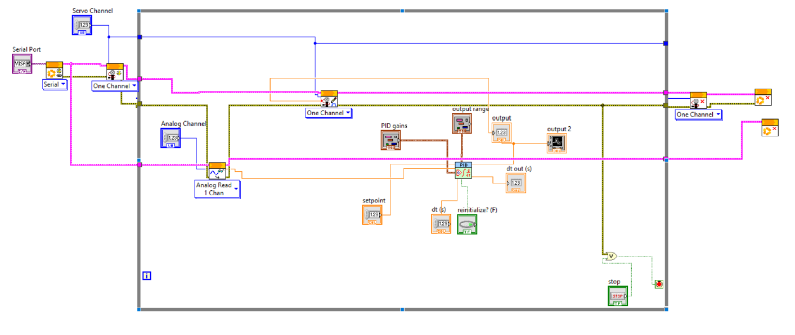
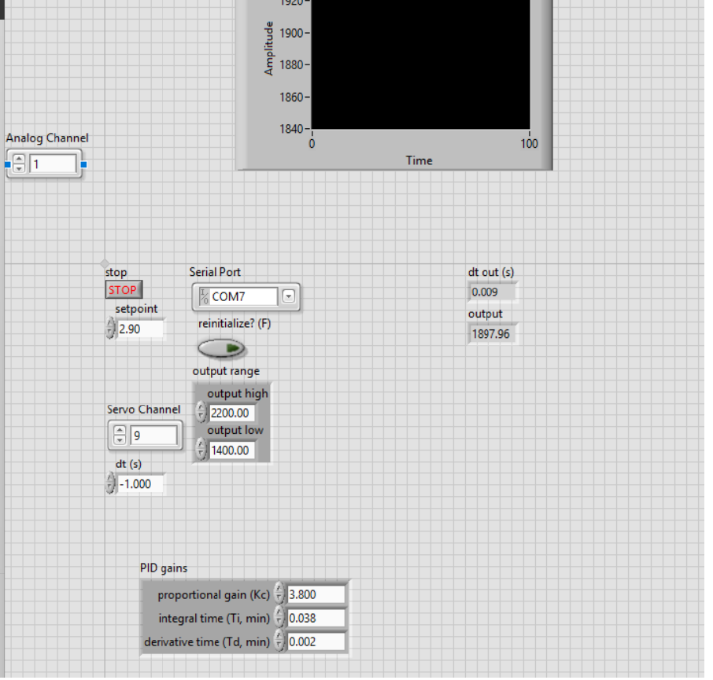

#  PID Control of a 1-DOF Helicopter

A closed-loop feedback control system that stabilizes a single-degree-of-freedom helicopter beam at a horizontal position using a **PID controller** implemented in **LabVIEW**, interfaced with an **Arduino Uno** via the **LINX toolkit**.

> 📚 Course: Control Systems — Mechatronics Engineering  
> 🏫 Egypt Japan University of Science and Technology (E-JUST)  
> 👥 Team: Kareem Shaban · Kamal Eldin Mohamed · Mohamed Ashraf

---

## 🎥 Demo Video

[](https://www.youtube.com/watch?v=8xZQIZMOoA4)

> Click the thumbnail to watch the system stabilizing the beam in real time.

---

## 📋 Overview

The 1-DOF helicopter is a classic **SISO (Single-Input Single-Output)** control benchmark. A beam is mounted on a pivot and allowed to rotate freely on the pitch axis. A motor with a propeller at one end provides thrust. Without active control, the beam is inherently unstable and falls to an extreme position.

The goal of this project was to implement a PID controller that continuously adjusts motor thrust to maintain the beam at a stable horizontal position, even in the presence of disturbances.

---

## ⚙️ System Architecture

```
[Setpoint: 2.90V]
       |
       ▼
  ┌─────────┐    PWM Signal     ┌──────────────┐
  │  PID VI  │ ────────────────► │ Arduino (LINX)│
  │(LabVIEW) │                  │  Servo Pin 9  │
  └─────────┘                  └──────┬───────┘
       ▲                              │ Motor Thrust
       │                              ▼
  Potentiometer              ┌──────────────────┐
  Voltage (A1)  ◄────────────│  1-DOF Beam Rig  │
                             └──────────────────┘
```
### LabVIEW Block Diagram



### LabVIEW Front Panel



### Key Components

| Component | Role |
|-----------|------|
| 1-DOF Helicopter Rig | Physical plant — beam on pivot |
| Potentiometer | Angle sensor — outputs voltage proportional to beam position |
| Arduino Uno (LINX firmware) | Hardware interface — reads sensor, drives motor |
| LabVIEW PID VI | Control logic — computes correction signal |
| Servo/Motor | Actuator — generates thrust to adjust beam angle |

---

## 🧠 Control Design

### Why PID?

PID control was selected for its proven effectiveness on SISO unstable systems:

- **Proportional (P):** Immediate correction proportional to current error
- **Integral (I):** Eliminates steady-state offset by accumulating past errors
- **Derivative (D):** Damps oscillations by reacting to rate of error change

### Final Tuned Parameters

| Parameter | Value | Effect |
|-----------|-------|--------|
| Proportional Gain (Kc) | **3.800** | Primary response strength |
| Integral Time (Ti) | **0.038 min** | Steady-state error elimination |
| Derivative Time (Td) | **0.002 min** | Oscillation damping |
| Output Range | **1400 – 2200 μs** | Motor pulse width limits |
| Setpoint | **2.90 V** | Target horizontal position |

---

## 🔧 Implementation Details

### Hardware Setup
- Potentiometer wiper → Arduino **Analog Pin A1**
- Motor/Servo signal → Arduino **Digital Pin 9**
- Arduino connected to PC via USB (COM7)

### LabVIEW VI Structure
1. **Initialization:** `LINX Open VI` establishes Arduino communication
2. **Feedback Loop:**
   - `LINX Analog Read` (Pin A1) reads potentiometer voltage as process variable
   - `PID VI` computes control output from error (setpoint − process variable)
   - `LINX Servo Write` (Pin 9) sends PWM signal to motor
3. **Termination:** `LINX Close VI` gracefully ends the session

### Interface (LINX vs VISA)
The project initially planned VISA serial communication with a custom Arduino sketch. This was replaced with the **LINX Toolkit** which abstracts low-level serial handling and allows LabVIEW to directly command Arduino I/O pins, simplifying development significantly.

---

## 🐛 Challenges & Solutions

### 1. Integral Windup
**Problem:** High initial integral gains caused the accumulated error to drive the output to saturation, making recovery impossible.  
**Solution:** Restart the VI to clear the PID state, then retune starting from zero I and D gains.

### 2. Sensor Noise
**Problem:** Motor vibrations introduced noise into the potentiometer readings, creating an unstable feedback signal.  
**Solution:** Conservative D-gain tuning to avoid amplifying noise; the derivative term was kept small (Td = 0.002).

### 3. Tuning Complexity
**Problem:** Interdependence of P, I, and D terms made manual tuning unintuitive.  
**Solution:** Adopted a sequential approach:
1. Set I = 0, D = 0. Increase P until the system responds without excessive oscillation.
2. Gradually decrease Ti to reduce steady-state error.
3. Add a small Td to dampen remaining oscillations.
4. Use the LabVIEW output graph for real-time visual feedback during tuning.

---

## 📁 Repository Structure

```
1dof-helicopter-pid/
├── README.md
├── labview/
│   └── 33.vi                  ← LabVIEW VI (main control program)
├── presentation/
│   └── PID_Helicopter_Presentation.pdf
└── report/
    └── Report_1DOF_Helicopter_Control.pdf
```

---

## 🛠️ Tools Used

- **LabVIEW** — Control logic and front panel UI
- **LINX Toolkit (MakerHub)** — Arduino–LabVIEW hardware interface
- **Arduino Uno** — Low-level sensor reading and motor actuation
- **LTspice / MATLAB** — Supporting analysis

---

## 🔮 Future Improvements

- Replace potentiometer with an **IMU** for noise-immune angle measurement
- Implement **digital filtering** on the feedback signal
- Build a **mathematical model** of the system for simulation-based tuning
- Explore **state-space feedback** or **LQR** control strategies

---

## 👤 Author

**Kareem Soliman** — Mechatronics Engineering Student, E-JUST  
[LinkedIn](https://linkedin.com/in/kareem-04-soliman) · [GitHub](https://github.com/Kareem-04)
